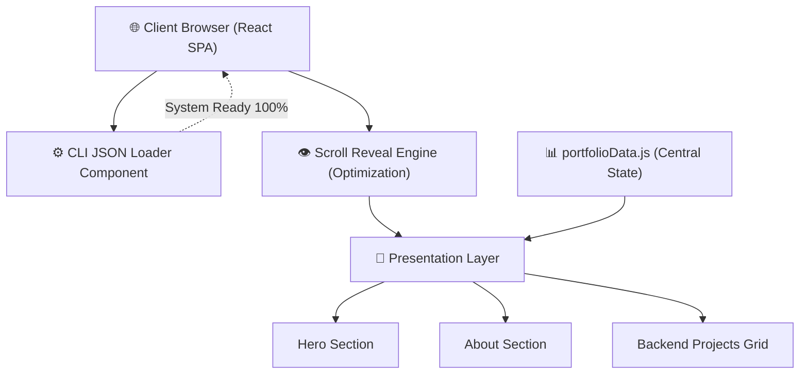

<div align="center">


<a href="https://readme-typing-svg.herokuapp.com"></a>

[](https://reactjs.org/)
[](https://vitejs.dev/)
[](https://berlinsugi.vercel.app/)

</div>

---

## 📌 Overview

**Hacker OS Portfolio** adalah portofolio interaktif berperforma tinggi yang mensimulasikan lingkungan ruang kontrol operasional (*mission control*). Dibangun menggunakan **React** dan **Vite**, aplikasi ini didesain khusus untuk menampilkan kapabilitas rekayasa teknis seorang **Backend Developer** kepada perekrut dan engineer senior, lengkap dengan efek visual 3D, animasi CSS terakselerasi GPU, dan performa mulus tanpa *lag*.

> 💡 **Tujuan Visual:** *"Don't just tell them you can code, show them a system initialization."* Dilengkapi dengan **CLI JSON Compiler Loading Screen** dan representasi layout arsitektur sistem.

---

## ✨ Fitur Unggulan

### 🖥️ CLI JSON Compiler Loader
Saat pertama kali dikunjungi, pengguna akan disambut oleh simulasi *terminal boot sequence* bergaya IDE Material Theme. Animasi ini mengeksekusi inisialisasi lingkungan *backend* dan mencetak objek profil pengguna secara dinamis dalam format JSON dengan *neon syntax highlighting*.

### ⚡ GPU-Accelerated Scroll Hooks
Sistem animasi gulir (*scroll*) menggunakan arsitektur kustom berbasis `IntersectionObserver` — memastikan portofolio ini mampu berjalan di atas 60 FPS pada semua perangkat pintar, membuang limitasi *main thread lag* yang kerap terjadi pada library animasi konvensional.

### 🛠️ Architecture Case Studies
Dilengkapi dengan modal **ProjectDetailModal** yang interaktif, menampilkan studi kasus proyek backend secara mendalam dengan penjabaran alur (workflow) diagram, mekanisme keamanan (seperti JWT & RBAC), serta rasionalisasi basis data (seperti InnoDB).

---

## 🏗️ Struktur Arsitektur (Data Flow)

Berikut adalah abstraksi dari alur pergerakan data pada sistem front-end interaktif ini (Diagram otomatis *Mermaid* ini dapat dirender langsung oleh GitHub):



---

## 🚀 Instalasi Lokal

Ingin menjalankan arsitektur portofolio ini di mesin lokal Anda?

```bash
# 1. Clone repositori ini
git clone https://github.com/B3rlinSugi/portfolio.git

# 2. Masuk ke direktori
cd portfolio

# 3. Install NPM dependencies
npm install

# 4. Jalankan server lokal (Vite)
npm run dev

# 5. Akses melalui peramban: 
# http://localhost:5173
```

---

## 👤 Tentang Author

<div align="center">

**Berlin Sugiyanto Hutajulu**  
*Junior Backend Developer*

[](https://github.com/B3rlinSugi)
[](https://linkedin.com/in/berlinsugi)

</div>
