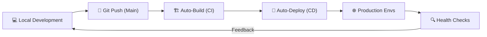

# 🖥️ System.Profile (B3rlinSugi)

  
  
  

---

### 🔎 Whoami
A high-performance **Backend Engineer** focused on building scalable, secure, and production-ready RESTful ecosystems. Expert in PHP (Laravel) and Java (Spring Boot) with a deep passion for relational database integrity and stateless terminal-grade architectures.

---

### 🚀 Core Engineering Stacks

| Ecosystem | Technologies |
|---|---|
| **Backend Core** | `Laravel 11+`, `Spring Boot 3.x`, `PHP 8.2`, `Java 17` |
| **Authentication** | `JWT (Stateless)`, `OAuth 2.0`, `Sanctum`, `RBAC` |
| **Data Persistence** | `MySQL 8.0`, `PostgreSQL`, `Eloquent ORM`, `Spring Data JPA` |
| **DevOps & Cloud** | `Docker`, `Railway`, `Vercel`, `CI/CD Pipelines` |
| **Visual Analytics** | `Chart.js`, `TCPDF / Dompdf`, `Grafana` |

---

### 📊 Vital System Statistics

  
   
  

---

### ⚙️ DevOps Lifecycle Workflow

I automate everything from local development to production rollout.

---

### 📁 Featured Projects

#### 1. [Sistem Data Akademik](https://github.com/B3rlinSugi/crud-akademik)
> Institutional-grade student record system with RBAC and automated PDF archiving.

#### 2. [Cash Flow Manager](https://github.com/B3rlinSugi/cash-flow)
> Legacy-to-Modern financial migration project with real-time fiscal analytics.

#### 3. [Student Management API (Laravel)](https://github.com/B3rlinSugi/student-management-api)
> enterprise-grade SIS backend with N+1 protected relational mapping.

---

### 🌐 Direct Uplink
- **Live Portfolio:** [berlinsugi.vercel.app](https://berlinsugi.vercel.app)
- **LinkedIn:** [berlinsugi](https://linkedin.com/in/berlinsugi)
- **Email:** `berlinsugiyanto23@gmail.com`

---

  

